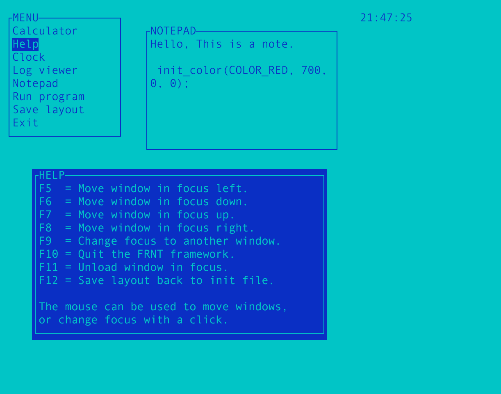

FRNT is a text based user interface based on [M80 framework by Kjetil](http://kobolt.dyndns.org/infocenter/index.php?article=7).

In itself, FRNT cannot do anything
and is reliant on modules to be loaded. Some sample modules are included in the
distribution to make the framework usable at once. All modules will be
represented by a window in the framework that provides the interaction.

##Installation:
FRNT and its modules are dependent on the ncurses terminal handling library, so
this must be installed before attempting to compile anything. A Makefile is
included, so when everything is set, just type "make" in the install directory
to compile FRNT and the sample modules that are included.
(The Makefile is setup to use the GNU C compiler, so you will have to tweak
it if you have another setup.)

##Notes:
Resizing the terminal while running FRNT is possible, but not recommended due to
some strange side effects like windows outside the screen, etc.
Only one module of its kind can be loaded at the same time.
Unloading all modules will terminate FRNT.
The default module directory is the current directory.

##Included Modules:

Menu       : Comprehensive menu system to ease general usage.

Clock      : Simple clock to provide current time.

Calculator : "Desk calculator" for integer calculations.

Notepad    : Provides a quick way to write down stuff.

Run Program: Run other programs while temporarily suspending FRNT.

Log Viewer : Monitor a file and immediately display changes.

##Keys:

The following functions keys are caught and used by the FRNT framework itself:

F5 =  Move window in focus left.

F6 =  Move window in focus down.

F7 =  Move window in focus up.

F8 =  Move window in focus right.

F9 =  Change focus to another window.

F10 = Quit the FRNT framework.

F11 = Unload window in focus.

F12 = Save layout back to init file.

All other keys are sent to the window in focus, and the behaviour is
dependent on the window module's actions.

If ncurses has mouse support, the FRNT framework will also support the mouse
to do simple operations like moving windows by dragging and changing focus
to a window by clicking on it.

##INIT FILE:
When starting up, FRNT will look for a init file to determine what modules to
load and where on the screen they should be placed initially. The default init
file is "frnt.init" in the current directory, but a different init file may
be specified by adding a command line argument to FRNT. If no (valid) modules
are found in the init file, or the init file is not found, FRNT will terminate.

##CREATING MODULES:
The goal of FRNT is to provide an easy way to customize it with new modules.

Modules need to include the "frnt.h" header file to define the module data
structure, and some other constants that provide interaction with the framework.

All modules must provide 5 functions that will be called by the framework on
different occasions:

*_init   : Called during loading of the module to setup data.

*_unload : Called during unloading of a module. (To free memory, handles, etc.)

*_redraw : Called every cycle to redraw the window (with or without focus.)

*_event  : Called when the module/window is in focus and receives an event.

*_tick   : Called every cycle to do background work.

The cyclic calls are done in this order: event, tick, redraw.
Drawing stuff to the window should generally be done in the redraw function,
but it is possible to do from the event or tick functions also. Since redraw
is called last, this should position the cursor correctly after it is done.
The redraw function will be called with a focus flag sometimes, and should then
draw its window differently to show the user that it is in focus. Two default
color pairs are provided to help with this.

No module should block in any of its functions, as this will affect the rest
of the system/framework and make the system look like it "hangs".

A module can send a command back to the FRNT framework manager to perform certain
special operations like:

- Terminate FRNT.                            (FRNT_COMMAND_EXIT)
- Load another module.                      (FRNT_COMMAND_LOAD)
- Unload another module or itself.          (FRNT_COMMAND_UNLOAD)
- Check if another module is loaded.        (FRNT_COMMAND_MOD_EXISTS)
- Change focus to another module or itself. (FRNT_COMMAND_NEW_FOCUS)
- Request to save layout back to init file. (FRNT_COMMAND_SAVE_LAYOUT)

A return code will be available after the command has been processed. But this
value is only reliable after the command request variable has been set back to
"FRNT_COMMAND_NONE" by the FRNT framework manager.

##Skeleton Module
Here is a basic skeleton module in C that can be used as a basis for a
new module:

	#include "frnt.h"
	void skeleton_event(frnt_module_t *m, int event) { }
	void skeleton_tick(frnt_module_t *m) { }
	void skeleton_redraw(frnt_module_t *m, int focus)
	{
	  if (has_colors())
	    wbkgd(m->w, COLOR_PAIR(focus ? FRNT_COLOR_FOCUS : FRNT_COLOR_COMMON));
	  else
	    wbkgd(m->w, focus ? A_BOLD : A_NORMAL);
	  box(m->w, ACS_VLINE, ACS_HLINE);
	  mvwprintw(m->w, 0, 1, "SKELETON");
	}
	void skeleton_unload(void) { }
	void skeleton_init(frnt_module_t *m)
	{
	  m->size_y = 10;
	  m->size_x = 10;
	}

The code can be compiled into a module with the following command:

    gcc -shared -fPIC -lc -Wl,-soname,skeleton.so -o skeleton.so skeleton.c

